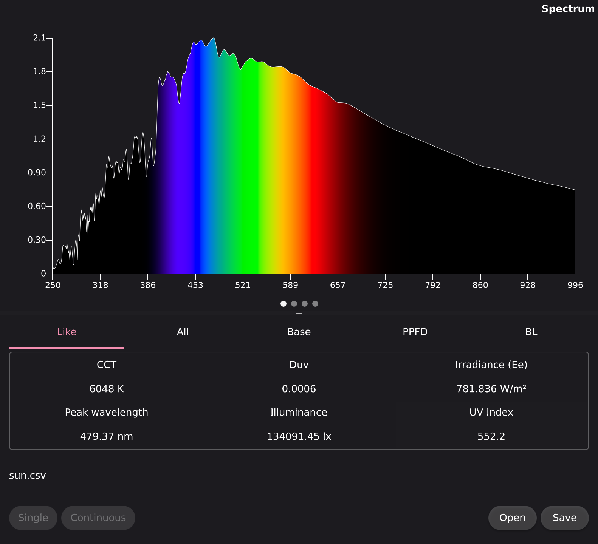

Spectrometer UI
===============

A small desktop application (C++23 and QML) providing a user interface for spectrometer measurements. The project can communicate with devices either via Qt's QSerialPort or directly through libusb. It computes TM-30 and CRI colour rendering metrics, among others.



## Requirements

- C++23 compiler
- CMake >= 3.31
- Qt 6.11 (QuickControls2, ShaderTools)
- Ninja (recommended generator)
- pkg-config and libusb-1.0 development package (if you intend to build with libusb)

## Default Release Build (Linux)

These commands create a Release build in `build/release` (no tests):

- Using Qt QSerialPort (default):

```bash
  cmake -B build/release -S . -G Ninja -DCMAKE_BUILD_TYPE=Release
  cmake --build build/release
```

- Using libusb:

```bash
  cmake -B build/release -S . -G Ninja -DCMAKE_BUILD_TYPE=Release -DUSE_QT_SERIAL_PORT=OFF
  cmake --build build/release
```

## Notes
- By default the project builds with QSerialPort support (CMake option `USE_QT_SERIAL_PORT` is `ON`). If you choose libusb, ensure `libusb-1.0` development files are installed and available to CMake/pkg-config.
- Tests are not built by default. To build tests enable `-DBUILD_TESTS=ON` at configure time.
- AddressSanitizer can be enabled at configure time with `-DUSE_ASAN=ON` (useful for memory debugging).

## Supported Devices
- Currently the only supported spectrometer is the Torchbearer device identified as "Y21B7W10034CCPD".
- The application can also analyze spectral power distribution (SPD) data from CSV files without a connected spectrometer.

## Acknowledgements
- The UI design is inspired by the [Flameeye](https://www.torchbearer.tech/support/download.html) software.
- Special thanks to the [Torch-Bearer-Tools](https://github.com/ZoidTechnology/Torch-Bearer-Tools) project for reverse-engineering work on the communication protocol used by the Torchbearer device.

## Platform Status
The program is intended to run on Android, desktop Linux, Windows, macOS. The codebase has not been compiled or validated on Windows or macOS yet.

## AI Contributions
The following parts of the program were in large part written by AI and validated by comparing their outputs against the Python colour-science library:

- CH341 libusb UART driver
- Robertson (CCT)
- Ohno 2013 (CCT)
- MacAdam (SDCM)
- Duv (including graph with shader)
- CRI (partially including bars graph)
- TM-30 (including bars graph)
- Dominant wavelength
- Tests
- Markdown files
